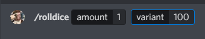

## About Hildibot

Hildibot is a discord bot that I made for my FFXIV guild to make server and raiding management easier.

### In short

Hildibot can:

- Greet new members

    
- Assign new members a "guest role"

    
- Kick members with "guest role" at scheduled time

    
- Post raid reminders at scheduled time

    

- Listen to slash command interactions, for example:

  

- Tag users for news, udpates and reminders, for example:

  

- Tell jokes!
  
  

- Users with specified role can manage Hildi's joke database:

  

  

- Roll dice!

  

  


### Future plans if I have time

Todo

- Put raidinfo and reminders into MariaDB instead of having separate jsons
- Requested: Updating raid reminders via dm's

Done
- Slash commands and event handling 
- Requested: roll dice / deathrolling 
- Requested: Joke command and database for jokes
- Requested: Add, find and remove jokes from database
- Role managment commands

## How to setup Hildibot for development

>Note 1: Hildibot does not support multiple servers at the same time!
>
>Note 2: You have to set up your own bot at https://discord.com/developers/applications

After you've cloned this repository you need to configure the following files with your own settings:

- .env
- raidInfo.json
- reminders.json

#### .env template:   
```
BOT_TOKEN= Your bot token
CLIENT_ID=Client ID found in devtools portal
GUILD_ID=Server ID found in Discord
WELCOME_CHANNEL= Server channel ID for welcome messages
GUEST_ROLE= Role ID for role that gets kicked
CRAFTINGUPDATES_ROLE=Role for people who want to get tagged for crafting updates
RAID_ROLE=Role for people who want to get tagged for raids
SPOILER_ROLE=Role for people who want access to spoiler channel
HILDIBOT_CONFIG_ROLE=Role that is allowed to use Hildibots /config command
BOT_LOG_CHANNEL= Server channel where bot sends notificatons of joined/kicked members
SCHEDULE_GUEST_KICK_JOB= Cron schedule expression for kicking members 
STATIC_CHANNEL= Server channel ID for channel with raiding members
CACTPOT_ROLE=Role to be tagged for the cactpot ticket reminder
EVENT_CHANNEL=Channel where the cactpot reminder goes (you can change this to anything you like that suits your needs better)

//For MariaDB
HOST=
USER=
PASSWORD=
DATABASE=
```

#### raidInfo.json template:
```
[
  {
    "day": "day",
    "jobSchedule": "* * * * *",
    "image": "/imagePath/image.png",
    "message": "Your message"
  },
  {
    "day": "day",
    "jobSchedule": "* * * * *",
    "image": "/imagePath/image.png",
    "message": "Your message"
  }
]

//For example
[
  {
    "day": "sunday", //Dev reminder for what day, not used anywhere
    "jobSchedule": "0 21 * * 7", //At 21:00 on every Sunday
    "image": "/imagePath/image.png", //Path to image embedded in message, can be url
    "message": "Reminder! Prog tomorrow!" //Message sent to channel
  }
]
```

#### Slash commands

> 1. For the slash commands to work you have register the commands.
>
> 1. You also need to create a reminders.json file for reminders for the specific Cactpot role only.

You can register commands with the following command in the terminal:

```
> npm run registerCommands
```

#### raidInfo.json template:
```
[
  {
    "day": "saturday (cactpot reminder)", //Dev reminder, not used anywhere
    "jobSchedule": "0 19 * * 6", //At 19:00 every Saturday
    "image": "", //Can use image if you want to, not used in my example
    "message": "<@&ROLE_ID> Greetings, friends! Remember to get your Jumbo Cactpot tickets. :cactus:"
  }
]
```

## Build

You can create distributable build with:
```
> npm run build
```
I run mine on a Raspberry Pi with Docker.

It is upto you in which way you configure the variables for the distributable version, you can create a separate .env file for the dist folder, or you can configure the variables in another way. Anyway you choose, you can then start the bot with the following command:
```
> node main.js
```
