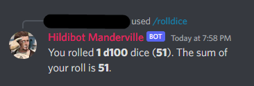

## About Hildibot

Hildibot is a discord bot that I made for my FFXIV guild to make server and raiding management easier.
> UPDATE 1.4.2023: Hildibot now has multiserver support.

### In short

Hildibot can:

- Greet new members

    
- Assign new members a "guest role"

    
- Kick members with "guest role" at scheduled time

    
- Post raid reminders at scheduled time

    

- Listen to slash command interactions, for example:

  

- Tag users for news, udpates and reminders, for example:

  

- Tell jokes!
  
  

- Users with specified role can manage Hildi's joke database:

  

  

- Roll dice!

  

  


### Future plans if I have time

Todo

- Put raidinfo and reminders into MariaDB instead of having separate jsons
- Requested: Updating raid reminders via dm's
- Requested: Deathrolling
- Discord.js upgrade

Done
- Slash commands and event handling 
- Requested: roll dice 
- Requested: Joke command and database for jokes
- Requested: Add, find and remove jokes from database
- Role managment commands
- Multiserver support

## How to setup Hildibot for development

>Note 1: You have to set up your own bot at https://discord.com/developers/applications

After you've cloned this repository you need to configure the following files with your own settings:

- .env
- raidInfo.json
- reminders.json

#### .env template:   
```
BOT_TOKEN= Your bot token
CLIENT_ID=Client ID found in devtools portal
SCHEDULE_GUEST_KICK_JOB= Cron schedule expression for kicking members 

//For MariaDB
HOST=
USER=
PASSWORD=
DATABASE=
```

#### raidInfo.json template:
```
[
  {
    "day": "day",
    "jobSchedule": "* * * * *",
    "image": "/imagePath/image.png",
    "message": "Your message"
  },
  {
    "day": "day",
    "jobSchedule": "* * * * *",
    "image": "/imagePath/image.png",
    "message": "Your message"
  }
]

//For example
[
  {
    "day": "sunday", //Dev reminder for what day, not used anywhere
    "jobSchedule": "0 21 * * 7", //At 21:00 on every Sunday
    "image": "/imagePath/image.png", //Path to image embedded in message, can be url
    "message": "Reminder! Prog tomorrow!" //Message sent to channel
  }
]
```

#### reminders.json template:
```
[
  {
    "day": "saturday (cactpot reminder)", //Dev reminder, not used anywhere
    "jobSchedule": "0 19 * * 6", //At 19:00 every Saturday
    "image": "", //Can use image if you want to, not used in my example
    "message": "<@&ROLE_ID> Greetings, friends! Remember to get your Jumbo Cactpot tickets. :cactus:"
  }
]
```

### MariaDB structure:
You also need to set up your own database. I used MariaDB and below is the structure you need:

```
JOKE DB:

CREATE TABLE `joke` (
  `id` bigint(20) NOT NULL AUTO_INCREMENT,
  `joke_text` text NOT NULL,
  PRIMARY KEY (`id`)
) ENGINE=InnoDB AUTO_INCREMENT=76 DEFAULT CHARSET=utf8mb4;s

SERVER CONFIG DB:

CREATE TABLE `config` (
  `name` varchar(100) DEFAULT NULL,
  `guild_id` bigint(20) unsigned NOT NULL,
  `welcome_channel` bigint(20) unsigned DEFAULT NULL,
  `guest_role` bigint(20) unsigned DEFAULT NULL,
  `cactpot_role` bigint(20) unsigned DEFAULT NULL,
  `craftingupdates_role` bigint(20) unsigned DEFAULT NULL,
  `raid_role` bigint(20) unsigned DEFAULT NULL,
  `spoiler_role` bigint(20) unsigned DEFAULT NULL,
  `bot_log_channel` bigint(20) unsigned DEFAULT NULL,
  `static_channel` bigint(20) unsigned DEFAULT NULL,
  `chat_channel` bigint(20) unsigned DEFAULT NULL,
  `hildibot_config_role` bigint(20) unsigned DEFAULT NULL,
  PRIMARY KEY (`guild_id`)
) ENGINE=InnoDB DEFAULT CHARSET=utf8mb4;
```

>Note! You need to add atleast one row to the config table which contains the configuration for your server.

#### Slash commands

For the slash commands to work you have register the commands.
You can register commands with the following command in the terminal:

```
> npm run registerCommands
```


## Build

You can create distributable build with:
```
> npm run build
```
I run mine on a Raspberry Pi with Docker.

It is upto you in which way you configure the variables for the distributable version, you can create a separate .env file for the dist folder, or you can configure the variables in another way. Anyway you choose, you can then start the bot with the following command:
```
> node main.js
```


## Dockerfile

Below is the dockerfile contents:

```
FROM node:16.15-alpine
RUN apk update && apk add tzdata
COPY ./dist /hildibot
COPY ./package.json /hildibot
WORKDIR /hildibot
RUN npm install --omit=dev
CMD ["node", "main.js"]
```