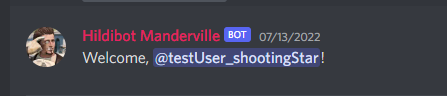

## About Hildibot

Hildibot is a discord bot that I made for my FFXIV guild. It's a simple bot that greets new members, auto-assigns new members a guest role and auto-kicks members who have the guest role at scheduled time (for example I scheduled it to be everyday at 4AM) unless the members have been assigned another role on the server. Hildibot also posts raid day reminders on our static channel.

### In short

Hildibot can:

- Greet new members

    
- Assign new members a "guest role"

    
- Kick members with "guest role" at scheduled time

    
- Post raid reminders at scheduled time

    

### Future plans if I have time

- Slash commands and event handling
- Callout rare FATE spawns
- Callout rare hunt spawns

## How to setup Hildibot for development

>Note 1: Hildibot does not support multiple servers at the same time!
>
>Note 2: You have to set up your own bot at https://discord.com/developers/applications

After you've cloned this repository you need to configure the following files with your own settings:

- .env
- raidInfo.json

#### .env template:   
```
BOT_TOKEN= Your bot token
WELCOME_CHANNEL= Server channel ID for welcome messages
GUEST_ROLE= Role ID for role that gets kicked 
BOT_LOG_CHANNEL= Server channel where bot sends notificatons of joined/kicked members
SCHEDULE_GUEST_KICK_JOB= Cron schedule expression for kicking members 
STATIC_CHANNEL= Server channel ID for channel with raiding members
```

#### raidInfo.json template:
```
[
  {
    "day": "day",
    "jobSchedule": "* * * * *",
    "image": "/imagePath/image.png",
    "message": "Your message"
  },
  {
    "day": "day",
    "jobSchedule": "* * * * *",
    "image": "/imagePath/image.png",
    "message": "Your message"
  }
]

//For example
[
  {
    "day": "sunday", //Dev reminder for what day, not used anywhere
    "jobSchedule": "0 21 * * 7", //At 21:00 on every Sunday
    "image": "/imagePath/image.png", //Path to image embedded in message, can be url
    "message": "Reminder! Prog tomorrow!" //Message sent to channel
  }
]
```

## Build

You can create distributable build with:
```
> npm run build
```

It is upto you in which way you configure the variables for the distributable version, you can create a separate .env file for the dist folder, or you can configure the variables in another way. Anyway you choose, you can then start the bot with the following command:
```
> node main.js
```